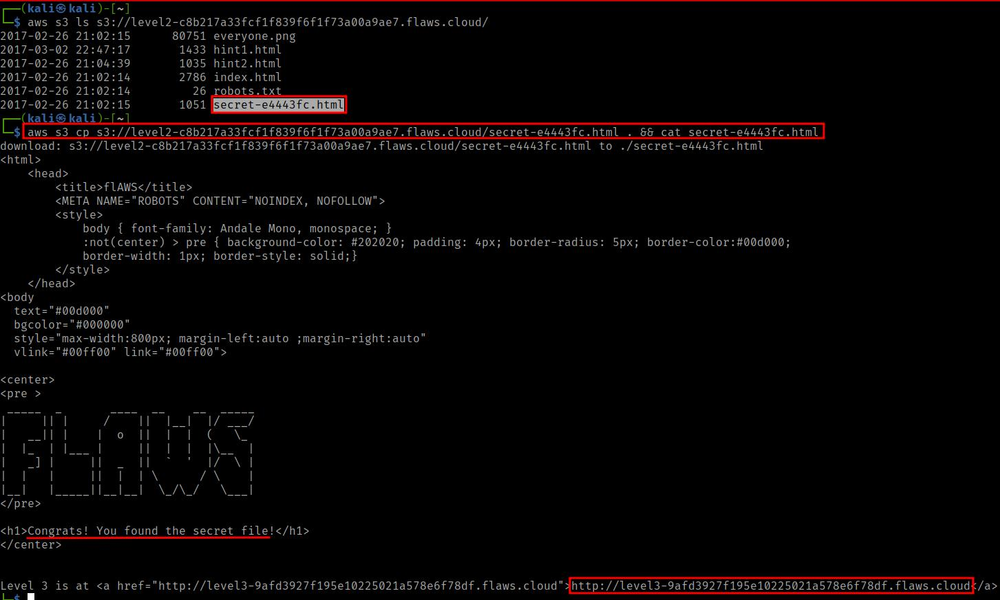
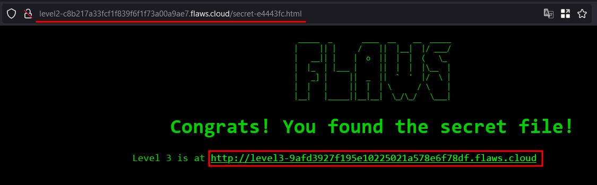
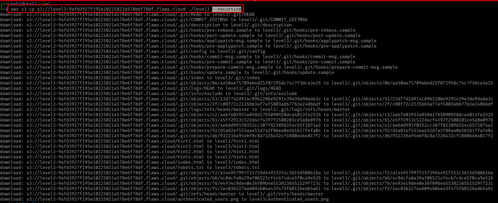
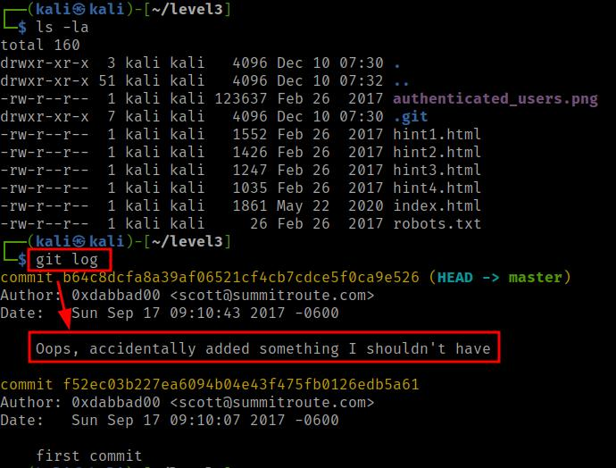
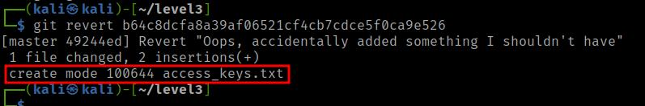
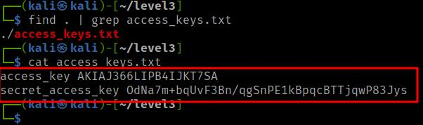
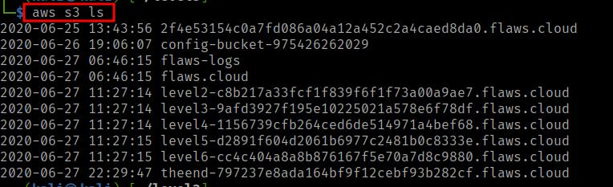

# flaws.cloud Walkthrough
:shipit: This is my version of [Flaws Cloud](https://flaws.cloud) challanges solution *(Level1-Level7)* 


## Prerequisites
 > 1. Any Linux distro
 > 2. AWS account -
 >   If you don't have a aws account, [Create New](https://portal.aws.amazon.com/billing/signup#/start/email)
 > 3. Any latest browser - Firefox, Chrome
 > 4. aws-cli tool - You can install using 
  > `sudo apt install awscli` or [Visit guide](https://docs.aws.amazon.com/cli/latest/userguide/getting-started-install.html) for detailed installation
  
## Level: 1 - Enumerate AWS
- **Vulnerability Title :** Insecure s3 bucket permissions leads to information discloure at flaws.cloud
- **Description:**
- 


>  This level is buckets of fun, see if you can find the first sub-domain.

This is the classic S3 bucket misconfigured permission issue. Anyone with a AWS account enumerate S3 bucket using AWS-cli tool.
On AWS you can set up S3 buckets with all sorts of permissions and functionality including using them to host static files. A number of people accidentally open them up with permissions that are too loose. Just like how you shouldn't allow directory listings of web servers, you shouldn't allow bucket listings. 

```bash
AWS-CLI commands used:
ls - to list bucket content
```

> aws s3 ls s3://flaws.cloud


We get **secret-dd02c7c.html** file, when we visit the file


OR

We can also list the bucket content by visting [http://flaws.cloud.s3.amazonaws.com](http://flaws.cloud.s3.amazonaws.com)


- **Mitigation:**

This issue can be mitigated by properly configuring s3 bucket permissions, regarding to keep it public or private.

If public, who can perform enumeration actions on the bucket like `ls, cp, mv` etc

By default, S3 buckets are private and secure when they are created. To allow it to be accessed as a web page, I had turn on "Static Website Hosting" and changed the bucket policy to allow everyone "s3:GetObject" privileges, which is fine if you plan to publicly host the bucket as a web page. But then to introduce the flaw, I changed the permissions to add "Everyone" to have "List" permissions.


---

## Level: 2 - Insecure s3 bucket 
- **Vulnerability Title :** Insecure s3 bucket permissions leads to information discloure
- **Description:**
 

  > The next level is fairly similar, with a slight twist. You're going to need your own AWS account for this. You just need the free tier. 

After we get our AWS-CLI installed, we can configure awscli to use our account. Refer to configure [AWS-cli](https://www.youtube.com/watch?v=BzzCIsjrE7U)

Lets see if we can access the bucket with aws-cli 
> aws s3 ls s3://level2-c8b217a33fcf1f839f6f1f73a00a9ae7.flaws.cloud/

> aws s3 cp s3://level2-c8b217a33fcf1f839f6f1f73a00a9ae7.flaws.cloud/secret-e4443f.html . && cat secret-e4443f.html



we get next level url i.e., [http://level3-9afd3927f195e10225021a578e6f78df.flaws.cloud/](http://level3-9afd3927f195e10225021a578e6f78df.flaws.cloud/)



- **Mitigation:**

Similar to opening permissions to "Everyone", people accidentally open permissions to "Any Authenticated AWS User". They might mistakenly think this will only be users of their account, when in fact it means anyone that has an AWS account. 
 *Only open permissions to specific AWS users.*

---

## Level: 3 - S3 bucket authentication AWS users 
- **Vulnerability Title :** Leaked AWS credentials are not rolled-out 
- **Description:**


  
  The next level is fairly similar, with a slight twist. Time to find your first AWS key! I bet you'll find something that will let you list what other buckets are.
```bash
AWS command used:
ls - to list bucket content
cp - to copy file from bucket or to bucket
--recursive flag - to copy all files from directory
```
We also need `git` command line tool to read git commit made, which leaked AWS credentials
```bash
Git command used:
log - to log all the commits made
revert - to revert to any other commit
```

> aws s3 ls s3://level3-9afd3927f195e10225021a578e6f78df.flaws.cloud 

We find a .git file, which indicates that the bucket is a github reposiroty, so to enumerate we will copy entire bucket in our local machine
> aws s3 cp s3://level3-9afd3927f195e10225021a578e6f78df.flaws.cloud ./level3 --recursive




After we have copied all the files in our local machine directory, we can use `git` commands to enumerate the repo

> cd ./level2

> git log



As we can see, we got a commit saying "accidentally added something I shouldn't have"

We will revert back to the git to read what was added
> git revert b64c8dcfa8a39af06521cf4cb7cdce5f0ca9e526



and read the content of the file **access_keys.txt**
> cat access_keys.txt 


  
To get the Level 4 URL we need to add the aws configuration credentials to `aws config` file
> aws config --profile level3

Enter the Access_key and Secter_Key & Enumerate the bucket

We can enumerate all s3 buckets that user has permissions to vist using, 
> aws s3 ls



- **Mitigation:**
People often leak AWS keys and then try to cover up their mistakes without revoking the keys. You should always revoke any AWS keys (or any secrets) that could have been leaked or were misplaced. Roll your secrets early and often. 

Always roll your secrets if you suspect they were compromised or made public or stored or shared incorrectly. Roll early, roll often. Rolling secrets means that you revoke the keys (ie. delete them from the AWS account) and generate new ones. 

---

## Level: 4 - EC2 snapshot
- **Vulnerability Title :** Insecure s3 bucket permissions leads to information discloure
- **Description:**


  This level is buckets of fun, see if you can find the first sub-domain.

- **Step to find:** 

---

## Level: 5 - AWS Magic number
- **Vulnerability Title :** Insecure s3 bucket permissions leads to information discloure
- **Description:**


  This level is buckets of fun, see if you can find the first sub-domain.

- **Step to find:** 

  
- **Mitigation:**

---

## Level: 6 - AWS Policies
- **Vulnerability Title :** Insecure s3 bucket permissions leads to information discloure
- **Description:**


  This level is buckets of fun, see if you can find the first sub-domain.

- **Step to find:** 

  
- **Mitigation:**

---

## Level: 7 - The end


---
