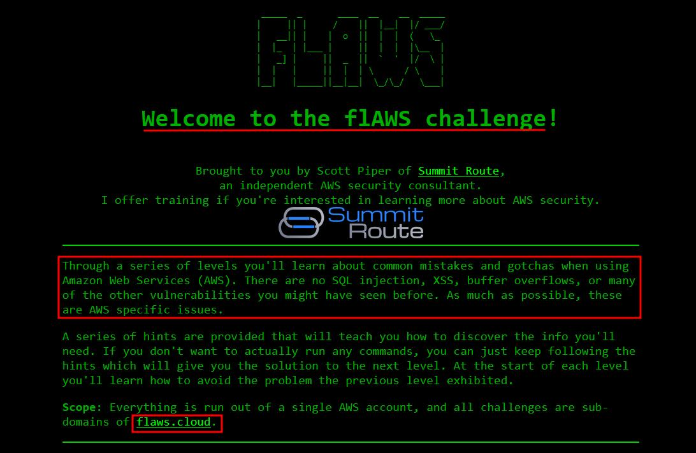
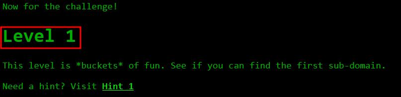
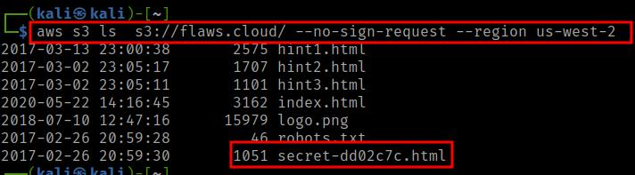
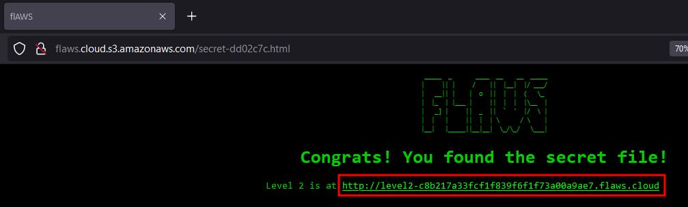
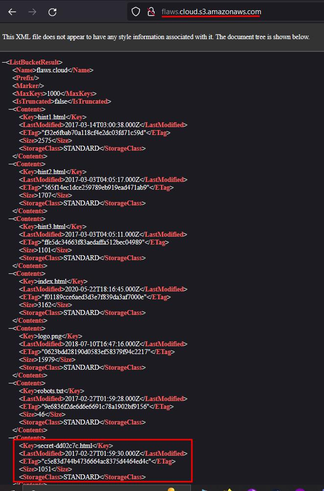
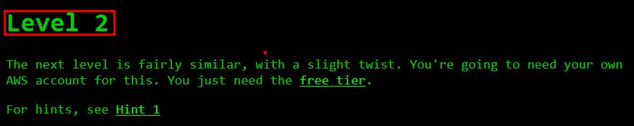
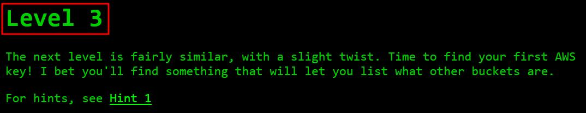
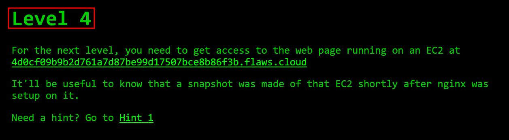
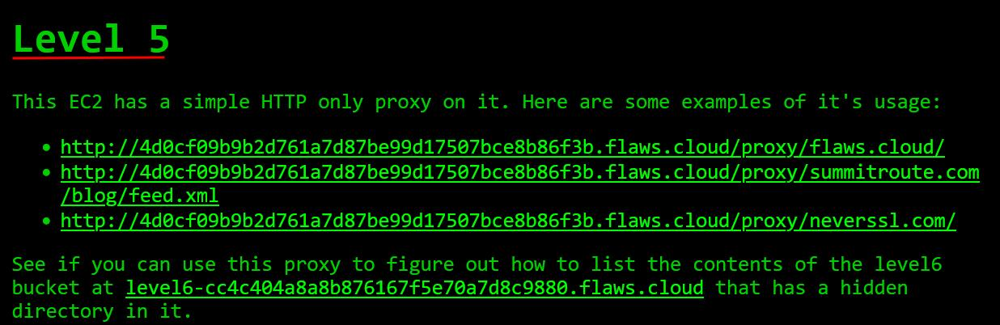
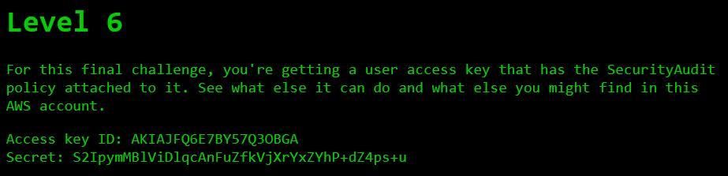

# flaws.cloud Walkthrough
:shipit: This is my version of [Flaws Cloud](https://flaws.cloud) challanges solution *(Level1-Level7)* 


## Prerequisites
 > 1. Any Linux distro
 > 2. AWS account -
 >   If you don't have a aws account, [Create New](https://portal.aws.amazon.com/billing/signup#/start/email)
 > 3. Any latest browser - Firefox, Chrome
 > 4. aws-cli tool - You can install using 
  > `sudo apt install awscli` or [Visit guide](https://docs.aws.amazon.com/cli/latest/userguide/getting-started-install.html) for detailed installation
  
## Level: 1 - Enumerate AWS
- **Vulnerability Title :** Insecure s3 bucket permissions leads to information discloure at flaws.cloud
- **Description:**

>  This level is buckets of fun, see if you can find the first sub-domain.

This is the classic S3 bucket misconfigured permission issue. Anyone with a AWS account enumerate S3 bucket using AWS-cli tool.
On AWS you can set up S3 buckets with all sorts of permissions and functionality including using them to host static files. A number of people accidentally open them up with permissions that are too loose. Just like how you shouldn't allow directory listings of web servers, you shouldn't allow bucket listings. 

```bash
AWS-CLI commands used:
ls - to list bucket content
```

> aws s3 ls s3://flaws.cloud



We get **secret-dd02c7c.html** file, when we visit the file



OR

We can also list the bucket content by visting [http://flaws.cloud.s3.amazonaws.com](http://flaws.cloud.s3.amazonaws.com)



- **Mitigation:**

This issue can be mitigated by properly configuring s3 bucket permissions, regarding to keep it public or private.

If public, who can perform enumeration actions on the bucket like `ls, cp, mv` etc

By default, S3 buckets are private and secure when they are created. To allow it to be accessed as a web page, I had turn on "Static Website Hosting" and changed the bucket policy to allow everyone "s3:GetObject" privileges, which is fine if you plan to publicly host the bucket as a web page. But then to introduce the flaw, I changed the permissions to add "Everyone" to have "List" permissions.


---

## Level: 2 - Insecure s3 bucket 
- **Vulnerability Title :** Insecure s3 bucket permissions leads to information discloure
- **Description:**
 

  > The next level is fairly similar, with a slight twist. You're going to need your own AWS account for this. You just need the free tier. 


- **Mitigation:**

---

## Level: 3 - S3 bucket authentication AWS users 
- **Vulnerability Title :** Insecure s3 bucket permissions leads to information discloure
- **Description:**


  
  This level is buckets of fun, see if you can find the first sub-domain.
`
cp - to copy file from bucket or to bucket
`

- **Step to find:** 

  
- **Mitigation:**

---

## Level: 4 - EC2 snapshot
- **Vulnerability Title :** Insecure s3 bucket permissions leads to information discloure
- **Description:**


  This level is buckets of fun, see if you can find the first sub-domain.

- **Step to find:** 

---

## Level: 5 - AWS Magic number
- **Vulnerability Title :** Insecure s3 bucket permissions leads to information discloure
- **Description:**


  This level is buckets of fun, see if you can find the first sub-domain.

- **Step to find:** 

  
- **Mitigation:**

---

## Level: 6 - AWS Policies
- **Vulnerability Title :** Insecure s3 bucket permissions leads to information discloure
- **Description:**



  This level is buckets of fun, see if you can find the first sub-domain.

- **Step to find:** 

  
- **Mitigation:**

---

## Level: 7 - The end


---
